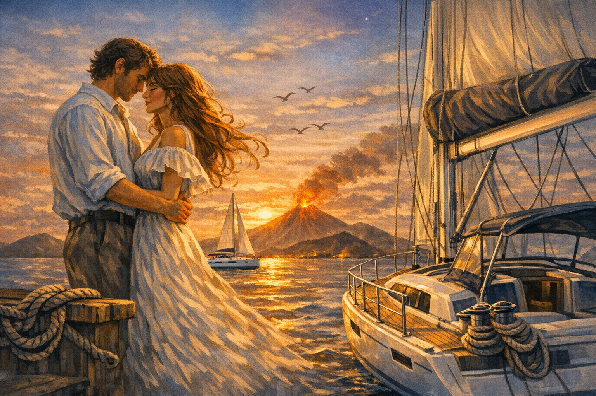

***

Тихо дышит синее море,  
Мягкий ветер тает в тиши,  
Солнце прячется в водном просторе  
Словно шепчет тайны души.

Белый парус по мачте скользит  
Отражаясь в зеркальной воде.  
И их лодка у пирса стоит  
Что бы завтра уйти по волне.

Там впервые они встретились взглядом,  
Закружилась у них голова.  
Показалось, что были рядом  
Много лет, не один и не два.

Первый шаг всегда трудно сделать,  
Проще чувства порой не признать.  
Но глаза, они могут поведать  
То, что губы боятся сказать.

Взгляд их встретился на мгновенье  
Душу тронул жаркий огонь  
И исчезло былое стесненье  
И коснулась ладони ладонь

Там вулканы дремлют в дали  
Там острова скрыты во мгле  
Там двое одной дорогой шли  
И стучали сердца в тишине

Руки рядом - тихо, тепло  
И не нужно им больше слов  
Словно море их подняло  
И умножило их любовь.

Счастье было их бесконечным  
Много моря, солнца и скал  
Только рай не бывает вечным  
Это каждый из них понимал.

А потом их позвали дороги,  
Разлучили чужие края.  
И как волны у дальних порогов,  
Разнесли их по свету года.

Он уходит сквозь время и бури  
Но хранит её сердца тепло  
Она помнит морские лазури,   
Где им было светло и легко.

Где-то ветер шепчет их имена  
Где-то море зовёт их опять  
Где-то ждёт их та же волна  
Чтобы вместе их повенчать

И однажды у края прибоя  
Где сливается небо и свет  
Снова встретятся двое у моря  
Словно не было долгих лет.

***